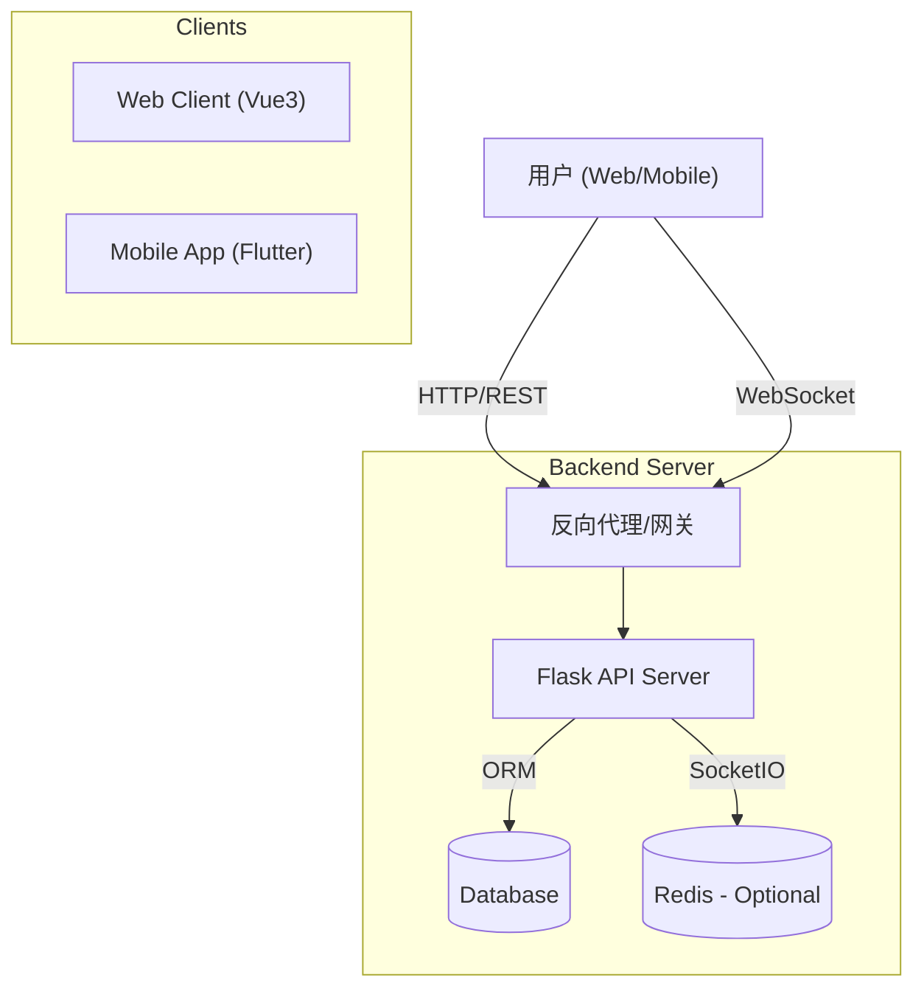

# CollabU - 学生团队协作与项目管理系统

<p align="center">
  
</p>

<p align="center">
  <a href="#项目介绍">项目介绍</a> •
  <a href="#核心功能">核心功能</a> •
  <a href="#技术栈">技术栈</a> •
  <a href="#系统架构">系统架构</a> •
  <a href="#快速开始">快速开始</a> •
  <a href="./API_DOCS.md">API 文档</a> •
  <a href="#贡献指南">贡献指南</a>
</p>

---

<span id="项目介绍"></span>
## 📖 项目介绍

**CollabU** 是一个专为学生团队设计的协作与项目管理平台。与传统的垂直管理工具不同，CollabU 采用**扁平化、民主化**的协作模式，旨在打破层级壁垒，激发团队成员的主动性和创造力。

在校园项目、比赛组队或社团活动中，CollabU 让每个成员都能平等地参与任务拆解、认领和进度管理，实现真正的全员协作。

### 核心理念
- **❌ 告别传统层级**: 不再是单纯的“发布命令-执行命令”。
- **✅ 拥抱扁平协作**: 强调“共同拆解-自由认领-全员参与”。

---

<span id="核心功能"></span>
## ✨ 核心功能

- **👥 扁平化团队管理**: 所有成员权限平等，均可邀请成员、创建项目、管理任务。
- **🧩 协同任务拆解**: 支持无限层级子任务，团队共同将大目标拆解为可执行的小任务。
- **🙋 自由认领机制**: 创新的“任务市场”模式，成员可主动认领感兴趣的任务。
- **📊 智能进度汇总**: 父任务进度自动根据子任务完成情况计算，实时掌握项目全貌。
- **💬 多维任务交流**: 
  - **异步讨论**: 任务内置评论区，支持富文本和文件附件。
  - **实时沟通**: 针对具体任务的实时聊天室 (WebSocket)。
  - **动态通知**: 全方位的动态时间线和即时通知系统。
- **📅 可视化甘特图**: 直观展示任务依赖与时间规划，支持拖拽交互。
- **📱 多端支持**: 提供 Web 端管理后台及移动端 (Android/iOS/HarmonyOS) App。

---

<span id="技术栈"></span>
## 🛠 技术栈

### Backend (后端)
- **Framework**: Python Flask
- **Database**: SQLite (Dev) / MySQL (Prod)
- **ORM**: SQLAlchemy + Flask-Migrate
- **Auth**: Flask-JWT-Extended
- **Realtime**: Flask-SocketIO (WebSocket)

### Frontend (前端)
- **Framework**: Vue 3 + Vite
- **UI Library**: Element Plus
- **State Mgmt**: Pinia
- **Gantt Chart**: @lee576/vue3-gantt
- **Network**: Axios + Socket.io-client

### Mobile (移动端)
- **Framework**: Flutter (Dart 3.6+)
- **Platforms**: Android, iOS, HarmonyOS (OpenHarmony)
- **Routing**: Go Router
- **State Mgmt**: Provider
- **Network**: Dio
- **Features**: QR Code Scanning, File Picker, Image Picker

---

<span id="系统架构"></span>
## 🏗 系统架构



---

<span id="快速开始"></span>
## 🚀 快速开始

### 环境依赖
- Python 3.8+
- Node.js 18+ (推荐)
- Flutter SDK 3.6+ (如需运行移动端)
- MySQL 8.0+ (生产环境推荐)

### 1. 后端启动 (Backend)

```bash
cd backend

# 创建虚拟环境
python -m venv venv

# 激活虚拟环境 (Windows)
.\venv\Scripts\activate
# 激活虚拟环境 (macOS/Linux)
# source venv/bin/activate

# 安装依赖
pip install -r requirements.txt

# 初始化数据库
flask db upgrade

# 启动服务 (默认端口 5000)
# 开发模式
python run.py
```

### 2. 前端启动 (Frontend)

```bash
cd frontend

# 安装依赖
npm install

# 启动开发服务器
npm run dev
```
访问: `http://localhost:5173`

### 3. 移动端启动 (Mobile)

确保已安装 Flutter 环境。

```bash
cd mobile

# 获取依赖
flutter pub get

# 运行 (连接设备或模拟器)
flutter run
```

---

## 📂 目录结构

```
CollabU/
├── backend/            # Python Flask 后端
│   ├── app/            # 应用代码 (Routes, Models, Services)
│   ├── migrations/     # 数据库迁移脚本
│   └── ...
├── frontend/           # Vue 3 前端
│   ├── src/            # 页面组件, Store, API 封装
│   └── ...
├── mobile/             # Flutter 移动端
│   ├── lib/            # Dart 代码 (Screens, Providers, Widgets)
│   ├── ohos/           # HarmonyOS 工程配置
│   ├── android/        # Android原生配置
│   └── ios/            # iOS原生配置
└── ...
```

## 使用zeabur部署后端
https://zeabur.com/

新建项目 - 选择印尼 - 从GitHub仓库部署 - 选择你fork的仓库

随后点击服务 - 设置 - 根目录 填入 /backend

在zeabur准备好你的image之后, 点击服务状态中的 - 命令 - 输入`flask db upgrade` 回车

点击 网络 - 公网访问 - 生成域名(自定域名)  配置你希望使用的域名


---

<span id="贡献指南"></span>
## 🤝 贡献指南

欢迎提交 Issue 和 Pull Request！

1. Fork 本仓库
2. 创建特性分支 (`git checkout -b feature/AmazingFeature`)
3. 提交更改 (`git commit -m 'Add some AmazingFeature'`)
4. 推送到分支 (`git push origin feature/AmazingFeature`)
5. 提交 Pull Request

## 📄 许可证

本项目采用 GPL-3.0 许可证 - 详见 [LICENSE](LICENSE) 文件
